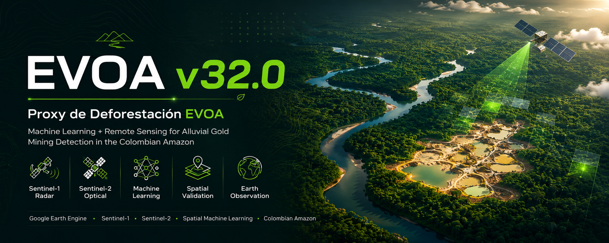

<p align="center">
  
</p>

<h1 align="center">EVOA v32.0 — Proxy de deforestacion EVOA</h1>

<p align="center">
  <b>Sistema de clasificación supervisada multitemporal con Machine Learning y Teledetección</b>
</p>

<p align="center">
  
  
  
  
  
  
</p>

---

## 📌 Resumen del Proyecto

Este proyecto desarrolla un **pipeline de clasificación supervisada** implementado en **Google Earth Engine (GEE)** para detectar perturbaciones de cobertura asociadas a la **Explotación de Oro de Aluvión (EVOA)** en tres zonas estratégicas de la Amazonía colombiana:

- **Chocó** — Zona de entrenamiento (mayor concentración nacional de EVOA: 37,841 ha en 2022)
- **Caquetá** — Validación externa norte (minería fluvial y múltiples motores de deforestación)
- **Puré** — Validación externa sur (Parque Nacional Natural Río Puré, triple frontera Colombia-Brasil-Perú)

El sistema integra datos ópticos **Sentinel-2**, radar **Sentinel-1**, índices espectrales, texturas **GLCM** y variables auxiliares para producir mapas anuales de cobertura en el periodo **2019–2025**, con validación cruzada espacial **K-Fold (4 cuadrantes)** y filtros post-clasificación morfológicos.

> 🔗 **Informe técnico completo:** [`informe/Informe_Entrega3_ML_EVOA_v32.pdf`](informe/Informe_Entrega3_ML_EVOA_v32.pdf)

---

## 🛠️ Stack Técnico

| Capa | Tecnología | Uso |
|------|-----------|-----|
| **Plataforma de procesamiento** | Google Earth Engine (GEE) | Ingesta, preprocesamiento y clasificación de imágenes satelitales a escala continental |
| **Lenguaje de scripting** | JavaScript (GEE API) | Pipeline de clasificación, extracción de firmas espectrales y exportación |
| **Análisis de resultados** | Python 3.11 | Post-procesamiento de métricas, visualización y validación estadística |
| **Librerías principales** | `pandas`, `numpy`, `matplotlib`, `seaborn`, `scikit-learn` | Matrices de confusión, K-Fold espacial, dashboards ejecutivos |
| **Entorno de desarrollo** | Google Colab / Jupyter Notebook | Prototipado y análisis exploratorio de series temporales |
| **Datos satelitales** | Sentinel-2 SR Harmonized, Sentinel-1 GRD IW | 10 bandas multiespectrales + polarizaciones VV/VH |
| **Índices espectrales** | NDVI, BSI, MNDWI, NDTI, EVI, NBR, NDSSI, NSMI | 28 bandas de entrada para el clasificador |
| **Texturas / Visión Computacional** | GLCM (contraste, ASM, entropía), filtros Sobel | Caracterización de textura superficial del paisaje |
| **Validación espacial** | K-Fold con 4 cuadrantes geográficos (NE, NO, SE, SO) | Evaluación de transferibilidad intra-regional |
| **Filtros temáticos** | HydroSHEDS, SRTM, JRC GSW, GHSL | Proximidad a ríos, pendiente, agua permanente, áreas urbanas |

---

## 📊 Resultados Clave

### Comparativa de Modelos (Chocó, 2022)

| Modelo | OA (%) | Kappa | F1-EVOA | Score Compuesto |
|--------|--------|-------|---------|-----------------|
| **Gradient Tree Boost (GTB)** | **85.85** | **0.810** | **0.9375** | **0.5896** 🏆 |
| Random Forest (RF) | 87.74 | 0.835 | 0.9231 | 0.5886 |
| SVM-RBF | 87.74 | 0.835 | 0.9231 | 0.5886 |
| CART (Línea base) | 84.91 | 0.797 | 0.8657 | 0.5586 |

> **Criterio de selección:** Score = 0.40×F1-EVOA + 0.25×OA + 0.15×F1-Agua + 0.20×F1-Secundaria

### Validación Cruzada Espacial (K-Fold, 4 cuadrantes)

- **OA media:** 78.6% ± 22.3%
- **Consistencia entre cuadrantes:** Confirma que el modelo no está sobreajustado a un sub-sector geográfico específico.

### Áreas Estimadas (Año representativo 2024)

| Zona | Bosque (ha) | EVOA (ha) | % EVOA | Contexto |
|------|-------------|-----------|--------|----------|
| Chocó | 1,010,845 | 19,620 | 1.62% | Entrenamiento + alta perturbación documentada |
| Caquetá | 1,590,167 | 139,044 | 7.53% | Validación externa norte — múltiples motores |
| Puré | 1,666,990 | 2,874 | 0.16% | Validación externa sur — minería predominantemente fluvial |

### Hallazgo Principal

El modelo entrenado exclusivamente en **Chocó (2022)** demostró **transferibilidad espacial genuina** al aplicarse sin reentrenamiento en **Caquetá** y **Puré**, con detecciones coherentes con reportes de campo de UNODC (2021–2022) y MAAP #228 (2025).

---

## 🗂️ Estructura del Repositorio

```
EVOA-v32-Amazonia-Colombia/
├── informe/              # Documento técnico completo (PDF)
├── code/
│   ├── gee/              # Scripts de Google Earth Engine (JavaScript)
│   └── python/           # Notebooks de análisis de métricas y visualización
├── data/                 # Metadatos y fuentes de datos de acceso abierto
├── results/              # Dashboards, mapas, matrices de confusión, series temporales
└── assets/               # Imágenes de soporte para documentación
```

> ⚠️ **Nota sobre datos:** Las imágenes satelitales Sentinel-2 y Sentinel-1 son de acceso abierto mediante el programa Copernicus de la ESA. No se incluyen los datasets brutos por su tamaño; se proporcionan los scripts de GEE para su reproducción exacta.

---

## 🚀 Cómo reproducir

### 1. Clonar el repositorio
```bash
git clone https://github.com/tuusuario/EVOA-v32-Amazonia-Colombia.git
cd EVOA-v32-Amazonia-Colombia
```

### 2. Ejecutar el pipeline en Google Earth Engine
1. Abre [code.earthengine.google.com](https://code.earthengine.google.com)
2. Copia el contenido de `code/gee/pipeline_evoav32_gee.js`
3. Ajusta las coordenadas ROI si es necesario
4. Ejecuta la extracción de firmas, entrenamiento y clasificación

### 3. Análisis de resultados en Python
```bash
pip install -r requirements.txt
jupyter notebook code/python/analisis_resultados.ipynb
```

---

## 📚 Cómo citar este trabajo

Si utilizas esta metodología o resultados en tu investigación, por favor cita:

```bibtex
@software{evoa_v32_amazonia,
  author = {Valencia Cuéllar, Brayan},
  title = {EVOA v32.0: Sistema de clasificación supervisada multitemporal para la detección de minería ilegal en la Amazonía colombiana},
  year = {2025},
  institution = {Universidad de la Amazonia, Facultad de Ingeniería},
  url = {https://github.com/tuusuario/EVOA-v32-Amazonia-Colombia}
}
```

---

## 👤 Autor

**Brayan Valencia Cuéllar** — Diseño y desarrollo completo del pipeline GEE, clasificación supervisada, validación espacial, análisis de métricas y generación de visualizaciones.

**Asignatura:** Inteligencia Computacional II  
**Docente:** Jesús Emilio Pinto Lopera  
**Institución:** [Universidad de la Amazonia](https://www.uniamazonia.edu.co) — Florencia, Caquetá, Colombia

---

## 🤝 Agradecimientos

- **MAAP (Monitoring of the Andean Amazon Project)** y **FCDS** — Validación de campo y contexto regional (MAAP #228)
- **UNODC / Ministerio de Minas y Energía** — Informes EVOA 2019–2022, datos de referencia
- **Google Earth Engine** — Infraestructura de procesamiento satelital
- **Copernicus / ESA** — Programa Sentinel de acceso abierto
- **Parques Nacionales Naturales de Colombia** — Contexto ecológico del PNN Río Puré

---

## 📄 Licencia

Este proyecto está licenciado bajo la Licencia MIT — ver el archivo [LICENSE](LICENSE) para más detalles.

> ⚠️ **Uso responsable:** Los mapas de EVOA generados deben interpretarse como "áreas de perturbación con firma espectral similar a minería de aluvión". La atribución directa a actividad minera ilegal requiere verificación de campo adicional.

---